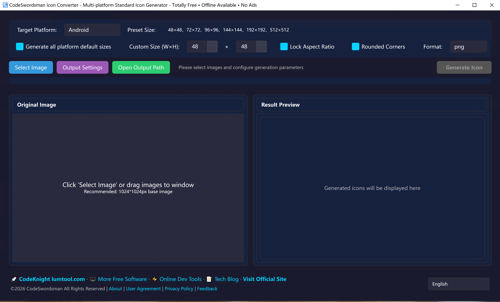
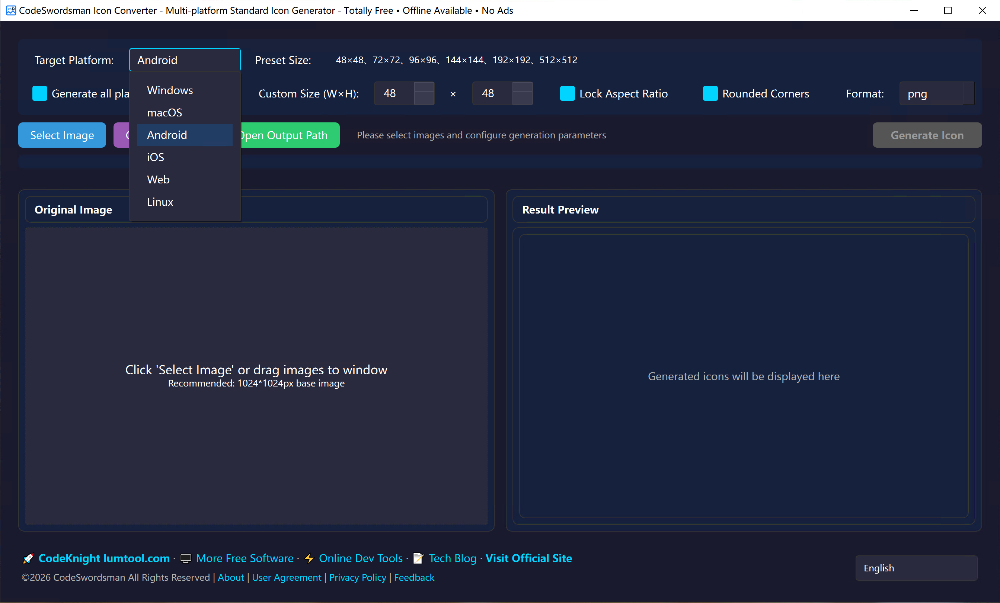
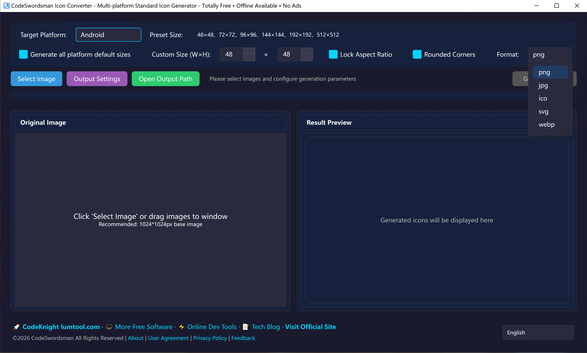
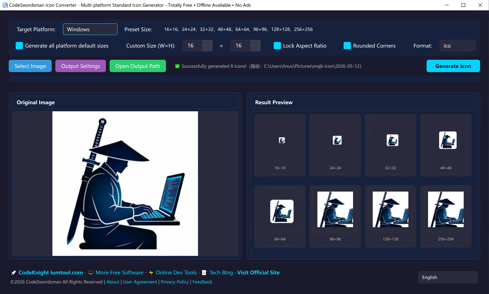
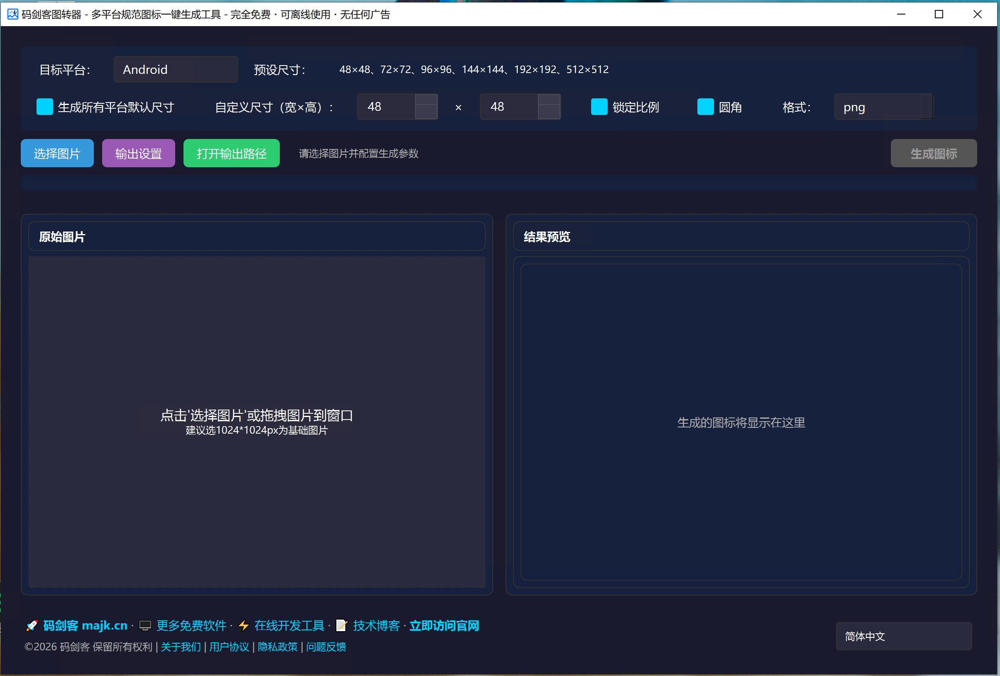
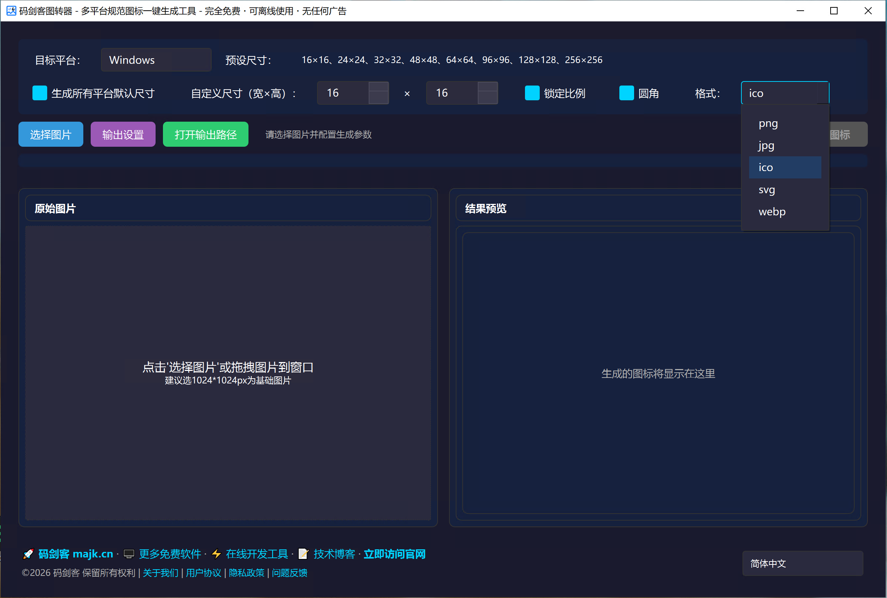
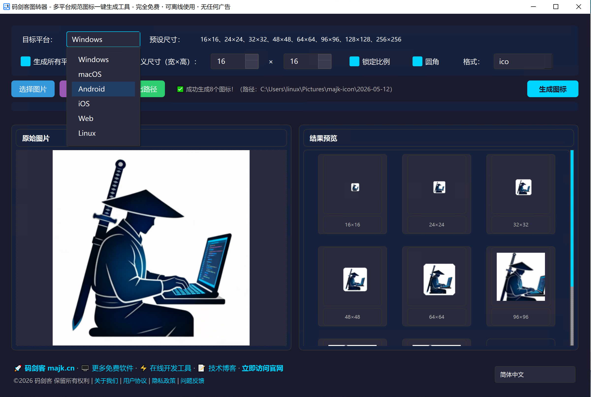

# 码剑客图转器 / CodeSwordsman Image Converter
Free, powerful, and easy-to-use image converter for everyone.

---

## 📖 About Us / 关于我们
致力于开发优秀的免费软件工具，深耕实用型工具领域，秉持高效、便捷的理念，为全球用户提供简洁易用、功能靠谱的使用体验，助力用户提升效率、简化操作。
We are committed to developing excellent free software tools, focusing on the field of practical utilities. Upholding the principles of efficiency and convenience, we provide users worldwide with a simple, easy-to-use and reliable experience, helping them improve efficiency and simplify operations.
中文官网：[https://www.majk.cn](https://www.majk.cn)
English Website：[https://lumtool.com](https://lumtool.com)

---

## ✨ Features / 功能特性

- **One-click Standard Icon Generation**: Generate standard icons for multiple platforms in one click
  多平台标准图标一键生成

- **Simple & Intuitive Interface**: Clean and straightforward UI with zero learning cost
  简洁直观界面，零学习成本

- **100% Free**: No ads, no bundles, no hidden fees
  完全免费，无广告、无捆绑、无隐藏收费

- **Fast & Stable**: Fast and stable with efficient processing
  快速稳定，高效处理

### 🖼️ Software Interface / 软件界面

#### English Interface
| Main Interface | Platform Selection |
|:--:|:--:|
|  |  |

| Format Selection | Result Preview |
|:--:|:--:|
|  |  |

#### 中文界面
| 主界面 | 平台选择 |
|:--:|:--:|
|  |  |

| 格式选择 | 结果预览 |
|:--:|:--:|
|  |  |

---

## Supported Platforms / 支持平台

| Platform | Supported Sizes | Output Formats |
|----------|----------------|----------------|
| Windows | 16×16, 24×24, 32×32, 48×48, 64×64, 96×96, 128×128, 256×256 | ICO |
| macOS | 16×16, 32×32, 64×64, 128×128, 256×256, 512×512, 1024×1024 | PNG, ICNS |
| iOS | 29×29, 40×40, 58×58, 60×60, 80×80, 87×87, 120×120, 152×152, 167×167, 180×180, 1024×1024 | PNG |
| Android | 48×48, 72×72, 96×96, 144×144, 192×192, 512×512 | PNG |
| Web | 16×16, 32×32, 48×48, 180×180, 192×192, 512×512 | PNG, SVG |

## 📋 Supported Formats / 支持格式
### Input Formats / 输入格式
JPG, PNG, BMP

### Output Formats / 输出格式
JPG, PNG, ICO, PDF, SVG

---

## 🚀 How to Use / 使用步骤
### English Version
1. Download and open the software
2. Add images or folders
3. Select the output format
4. Click to start conversion
5. Files are automatically saved to the target directory

### 中文版
1. 下载并打开软件
2. 添加图片或文件夹
3. 选择输出格式
4. 点击开始转换
5. 自动保存到目标目录

### 📺 Demo Video / 演示视频
- English: [CodeSwordsman Image Converter Demo](assets/en/CodeSwordsman-image-converter.mp4)
- 中文: [码剑客图转器演示](assets/zh/majk-icon.mp4)

---

## 💻 Download / 下载
Latest version: v1.0.0
👉 [https://github.com/CodeSwordsmanDev/CodeSwordsmanImageConverter/releases](https://github.com/CodeSwordsmanDev/CodeSwordsmanImageConverter/releases)

### 📦 Supported Installation Packages / 支持安装包类型
- Windows: .exe 安装包 / 绿色便携版
- macOS: .dmg 镜像包

---

## 📜 License / 授权协议
### 核心声明
⚠️ 本软件为**闭源免费软件**，仅开放下载和使用，不公开源代码。

This software is free for personal non-commercial use only.
Commercial use, resale, decompilation, and unauthorized distribution are prohibited.
All rights reserved by CodeSwordsmanDev.

本软件为免费软件，仅供个人非商业使用。
禁止二次分发、倒卖、破解。
软件版权归CodeSwordsmanDev所有。

For more details, please see the [LICENSE](LICENSE) file.

---

## 🚫 Restrictions / 使用限制
- 仅限个人非商业使用，禁止商用、倒卖、破解、二次分发；
- 禁止逆向工程、反编译、修改软件本体。

---

## 🤝 Feedback / 反馈
If you have any questions or suggestions, please submit an Issue on GitHub.

如有问题或建议，欢迎在 GitHub 提交 Issue。

---

## ❓ FAQ
Q: 是否开源源代码？
A: 本软件为闭源免费工具，暂不公开源代码，仅提供可执行安装包供个人非商用使用。

Q: 下载的安装包有病毒吗？
A: 所有安装包均通过 GitHub Releases 官方分发，无捆绑、无广告、无恶意代码，可放心下载。

---
